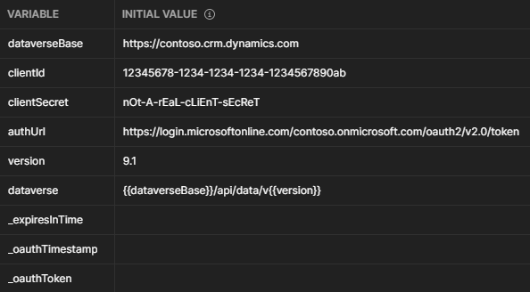
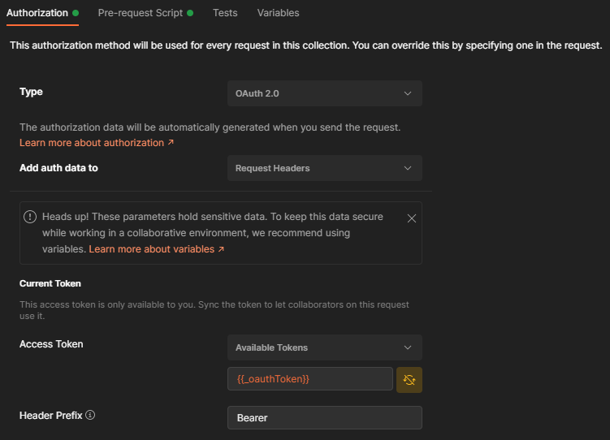

# Automate Dataverse OAuth in Postman

This handy lil script makes it easy to access your Microsoft Dataverse environment's web API using Postman. You can either import the provided configuration files for a quick start [here](#quick-start) or do-it-yourself with manual configuration [here](#diy). This setup is modified from [this Medium blog post](https://medium.com/@allen.helton/how-to-automate-oauth2-token-renewal-in-postman-864420d381a0) to work  specifically for Microsoft Dataverse.

# Prerequisites

You'll need the following stuff to get started.
- [Postman](https://www.postman.com/downloads/)
- A client ID and secret provided during app registration ([Configure Dataverse for OAuth](https://docs.microsoft.com/en-us/powerapps/developer/data-platform/authenticate-oauth))

# Quick Start

## Quick Start - Step 1
### Set up your environment variables

Import the sample Dataverse environment into Postman using [dataverse-env.postman_environment.json](./dataverse-env.postman_environment.json). Replace the text in angle brackets with your environment's unique domain, client ID, and client secret. Click "Reset All" and then save. Your Postman environment should look something like this:

The variables prefixed with an underscore (`_`) are automatically created and populated by the pre-request script, while `dataverse` and `version` are merely a convenience for composing new Dataverse requests.

## Quick Start - Step 2
### Import the request collection

Import the sample Dataverse request collection into Postman using [dataverse.postman_collection.json](./dataverse.postman_collection.json). This includes the OAuth settings, pre-request token renewal script, and a sample request.

## Quick Start - Step 3
### Verify your setup

Set the current Postman environment to the one that you just imported. Open the `GET` request named Sample Request included in the collection, and hit Send. If you get a `200 OK` response status, you're good to go! Any request you create within this collection will automatically renew your OAuth token, so long as the Authorization of each request is set to "Inherit auth from parent" which is also the default setting.

# DIY

## DIY - Step 1
### Set up your environment variables

Create or edit a Postman environment to store your Dataverse environment settings. Define variables `dataverseBase`, `clientId`, `clientSecret`, and `authUrl`. Reference Quick Start - Step 1 for example values.

## DIY - Step 2
### Set up authorization for a collection

Create or open a Postman collection that you'll use to store your Dataverse web API requests. In the collection settings under Authorization, enter the following configuration values:

Set type to OAuth 2.0, Add auth data to request headers, enter `{{_oauthToken}}` as the access token, and enter `Bearer` as the header prefix.

## DIY - Step 3
### Copy the pre-request script

Copy the contents of [pre-request.js](./pre-request.js) into the Pre-request Script text area of your Postman collection. Save the collection settings.

## DIY - Step 4
### Verify your setup

Create or open a request within your Postman collection. Enter a valid web API endpoint within your Dataverse environment, for example `GET https://contoso.crm.dynamics.com/api/data/v9.1/WhoAmI`. Under the request's authorization tab, ensure type is set to "Inherit auth from parent". Hit send. If your response status is in the `2XX` range, you're good to go!
